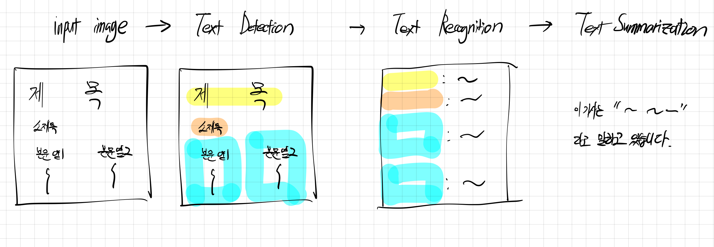
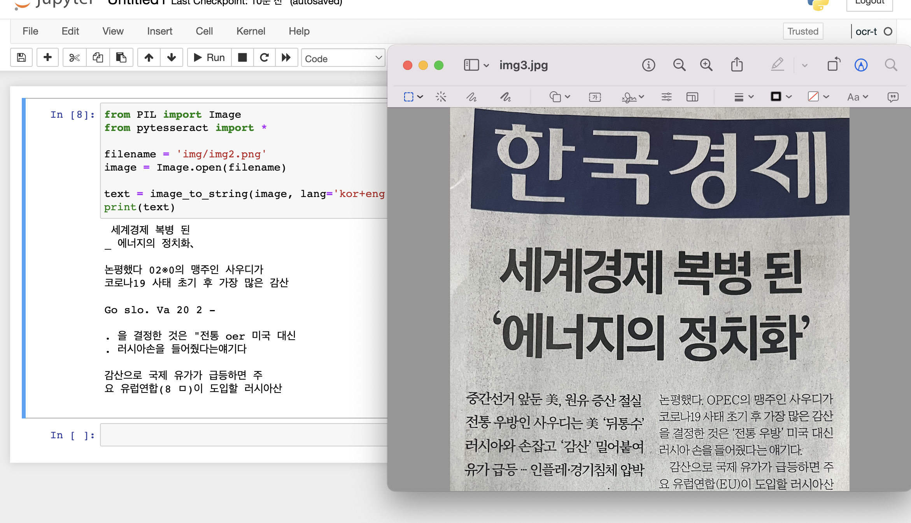
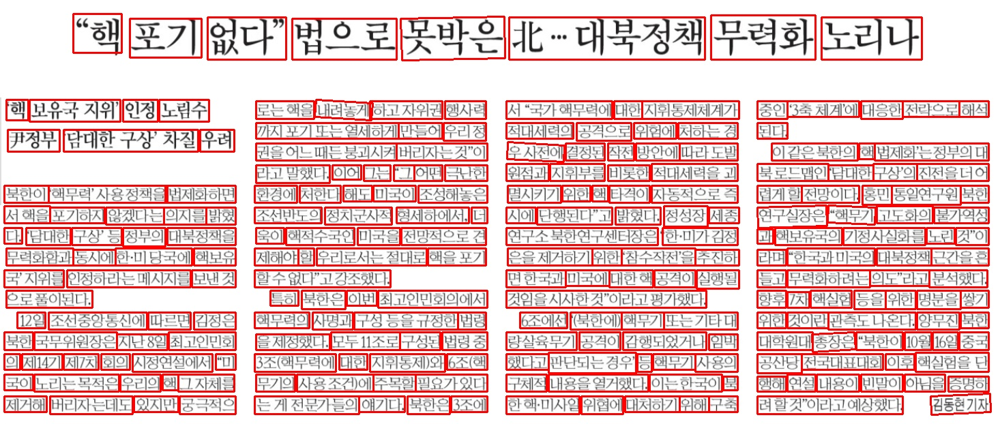

# 딥러닝 프로젝트

## idea

idea : 신문 이미지 → text → summarization 을 하는 앱

1차 목표 : 신문기사 이미지를, text로 반환 

CRAFT : 기존의 한 단어, 단위로 하던 바운딩박스를 한 문단으로 묶어주기

DTRB : 기존의 영어 모델이기 때문에, 한국어로 파인튜닝

파인튜닝 시에, 일반 한국어 데이터 vs 기사 데이터 를 비교하면 좋을듯

2차 목표 : text화 된 한국어 기사를  한 문장으로 요약

KoBART-summarization 을 AI  hub로 fine tuning 

3차 목표 : 갤러리 접근 / 요약기능을 하는 애플리케이션 만들기



## proposal

제목 : 종이 신문기사 이미지로부터 기사 요약 

### 1. introduction

최근 수강중인 교양수업에는 매일 종이신문을 읽고 기사를 요약해야 하는 과제가 있다. 매일 최신화가 되는 신문을 읽고 요약하는 것은 꽤 시간이 걸리는 작업으로, 머신러닝 모델을 통해 자동화될 수 있겠다는 생각이 들었다.

본 프로젝트는 종이 신문 기사 이미지로부터 디지털화된 텍스트를 생성하고, 생성된 텍스트로부터 이를 요약해주는 머신러닝 모델을 설계해보고 구현해보고자 한다. 이미지로부터 텍스트를 생성하는 컴퓨터 비전 task인 OCR(Optical Character Recoginion)과 텍스트로부터 핵심 문장을 요약해주는 자연어처리 task를 수행하는 모델을 구현 및 학습해보고, 신문이미지로부터 한 문장으로 기사를 요약해주는 end-to-end 애플리케이션을 구현하는 것이 최종 목표이다.

### 2. Problem definition & challenges

본 프로젝트의 핵심 task는 OCR모델의 구현 및 학습이다. OCR모델은 네이버 CLOVA OCR, TesseractOCR 등의 훌륭한 애플리케이션이 이미 존재하지만 단락과 열이 존재하는 신문 기사의 특성 상 완벽한 텍스트인식이 제대로 되지 않음을 확인할 수 있었다. 이를 해결하기 위해 pretrained model에  신문기사 이미지와 텍스트를 fine tuning 하는 방법과 text detection에서의 바운딩 박스의 좌표값을 이용하여 문단별로 text recognition을 하는 방법을 시도해 볼 예정이다.

예상되는 challenge는 다음과 같다. 우선 text detection / recognition / summarization 에 대한 모델들의 학습이 한정된 시간에 이루어져야 보니 학습환경과 시간에 제약을 많이 받을 것이다. 또한 사용될 머신러닝 모델들에 대한 학문적 베이스가 아직은 부족한 상태이기 때문에 이를 구현하고 활용하는데 필요한 선행 공부가 절실한 상황이다. 두 번째로는 한글 신문과 한글 텍스트, 한글 요약을 목적으로 하다보니 데이터가 상대적으로 부족하며, 데이터 전처리 과정에서 더 까다로울 것으로 생각된다. 이는 크롤링과 직접 찍은 신문 사진 등을 활용하여 해결해 볼 것 이다.

### 3. Related Works

본 프로젝트의 핵심 task인 OCR모델과 관련하여 발표된 선행연구는 다음과 같다.

- CRAFT / TPS-ResNet(Naver Clova) : 본 프로젝트의 baseline이며 공개된 pretrained-model를 fine-tuning할 것이다.
- Tessrect OCR(Google) : 오픈소스 텍스트인식 엔진
- EasyOCR : Text Detection으로 CRAFT를 사용하고, Recognition으로는 CRNN을 사용한 모델이다.

### 4. Datasets

본 프로젝트의 학습을 위해 사용할 데이터셋은 다음과 같다.

1. 한국경제신문 실물 이미지(직접 촬영), 한국경제신문 웹사이트 크롤링을 통한 텍스트 레이블
2. 한국어 텍스트 인식 학습을 위한, 한국어 인쇄체, 인쇄체 증강 데이터(from AI HUB)
3. 기사 요약을 위한 한국어 신문기사, 문서요약 데이터 (from 한국어 문서 추출요약 AI 경진대회)

오픈 소스로 공개된 데이터 외에 직접 촬영하는 데이터는 augmentation을 통해 부족한 개수를 보충한다.

[https://dacon.io/competitions/official/235671/overview/description](https://dacon.io/competitions/official/235671/overview/description/)

### 5. State-of-the-art methods and baselines

OCR에서 SOTA는 82.6\% 정확도를 기록하고 있는 MaskOCR로,  transformer 기반의 masked encoder-decoder 모델이다.  Baseline으로는 네이버에서 발표한 text detection에서는 CRAFT 모델을 이용할 예정이며, text recognition에서도 역시 네이버 Clova에서 공개한 TPS-ResNet을 이용할 예정이다.

### 6. Scedule

~ 10/16  관련 논문 공부 및 데이터 수집(상시수집)

~ 10/23  모델 시험 및 baseline 모델 학습

~ 11/20 모델 구현 및 학습

~ 11/27 애플리케이션 완성 

~ 12/5 리포트 작성 및 제출

## 데이터셋

한국어 기사 요약 : [https://dacon.io/competitions/official/235671/data](https://dacon.io/competitions/official/235671/data)

AI HUB() : [https://www.aihub.or.kr/](https://www.aihub.or.kr/)

## 개발환경

python 3.7

## pipeline

1차 목표 : 기존 모델을 활용하여 

1. input : 한글 기사 이미지 데이터셋 만들기
    1. 헤드라인 / 막 여러개로 분리 해야 하는 어려움.
2. Text Detection : 바운딩 박스 처리 → CNN을 주로 사용 (CRAFT)
    - 네이버 CRAFT
    - 관련
        
        craft 논문 : [https://arxiv.org/abs/1904.01941](https://arxiv.org/abs/1904.01941)
        
        craft 논문 리뷰 : [https://medium.com/@msmapark2/character-region-awareness-for-text-detection-craft-paper-분석-da987b32609c](https://medium.com/@msmapark2/character-region-awareness-for-text-detection-craft-paper-%EB%B6%84%EC%84%9D-da987b32609c)
        
        craft 깃헙 : [https://github.com/clovaai/CRAFT-pytorch](https://github.com/clovaai/CRAFT-pytorch)
        
    - 해야 할 일
        
        크래프트로 text detection 직접 해보기
        
3. Text Recognition :  bounding 박스가 어떤 내용인지 알아냄. → RNN/Transformer
    - 네이버 deep-text-recognition

## 참고자료

- 한국 의약품 OCR 인식 : [https://cvml.tistory.com/18](https://cvml.tistory.com/18)
- 티켓 OCR 분석 : [https://velog.io/@hyunk-go/크롤링-Tesseract-OCR-EasyOCR-OpenCV-그리고-학습](https://velog.io/@hyunk-go/%ED%81%AC%EB%A1%A4%EB%A7%81-Tesseract-OCR-EasyOCR-OpenCV-%EA%B7%B8%EB%A6%AC%EA%B3%A0-%ED%95%99%EC%8A%B5)
- OCR 최신 동향 : [https://yongwookha.github.io/MachineLearning/2022-02-08-current-ocrs](https://yongwookha.github.io/MachineLearning/2022-02-08-current-ocrs)
- bertsum 한국어 :[https://velog.io/@raqoon886/KorBertSum-SummaryBot](https://velog.io/@raqoon886/KorBertSum-SummaryBot)
    

## 챌린지

1. CRAFT, deep-text-recognition이 얼마나 잘 되는지를 확인해야함.
2. TessractOCR
3. EasyOCR

## 깃, 주피터 명령어

- conda env list : 가상환경
- 맥os python3.6 설치 :
    [https://stackoverflow.com/questions/70205633/cannot-install-python-3-7-on-osx-arm64](https://stackoverflow.com/questions/70205633/cannot-install-python-3-7-on-osx-arm64)
    
- jupyter notebook kernel 추가
    pip install ipykernel 
    python -m ipykernel install --user --name 가상환경 이름 --display-name 커널 이름
    

## 개발일지

- 10/11 (화)
    1. naver Craft로 바운딩 박스 띄워보기 → 성공
        - 거의 건들지 않아도 될 수준으로 학습이 잘 되어 있음, 학습을 내가 추가적으로 시키지도 못함.
        - training code가 공개되지 않아서, fine tuning을 할 수도 없음 → 프로젝트에 딥러닝 포인트가 없을듯.
        - 만약 이걸로 하면, 바운딩 박스를 클러스터링해서 image recognition 을 하면 문제는 txt를 잘 뽑아 낼 수는 있을 듯.
        - [Error] OSError: image file is truncated : 사이즈 조절 필요함.
          
            
    2. tessact OCR 
        
        [EasyOCR 사용자 모델 학습하기 (1) - 시작하기 전에](https://davelogs.tistory.com/76)
        이 사람 블로그 많이 참고함.
        - 결과 : craft 보다는 상당히 구리지만, 그만큼 학습의 여지가 많이 남아있음. 학습과정도 뒤에 설명되있어서 이걸로 하면 좋을듯
        
        
        
        - tesseract에서 앞으로 해야 할 일
            1. 파이썬 코드 없이 C/C++ base인게 문제
            2. 코드 쪼개서 이미지에 바운딩 박스 만들어보기
            3. 모델 학습하기
            4. evaluation 생각하기
            5. **바운딩 박스 제대로 해서 단락화시켜서 텍스트화하기**
            
- 10/14 (금)
    1. Easy_Ocr test
        - 테스트 결과
            [easy ocr 결과](https://www.notion.so/easy-ocr-22c532b5267543a9a756cddcb9072e0f)
        - 꽤 정확한 수치이지만 평범한 글자임에도 아직 완벽하게 읽지는 못하고 있음.
        - 바운딩 박스 정확
    
    1. baseline과 방향 관련
        
        baseline : finetuning 하지 않은 easyocr
        → finetune한 이후 text recognition에서 유의미한 차이 보이기
        → 바운딩 박스 / 볼드체 등으로 분류해서 단락별로 텍스트 처리가 되어 확실한 차이 불러오기
        → 위의 방법 말고, 단락단위 학습을 시켜서 제대로 나오는지도 확인해보고 싶음.
        
    2. 데이터셋은 어떻게 할 것인가.
        - 크롤링을 해야 하나? → 단순히 한글화만 시키면 되서  딱히 필요없긴함. 아님!!
        - AI hub에서 구하기
        1. textRecognitionDataGenerator 로 만든 한국어 데이터셋
        2. 캡쳐한 이미지, 크롤링한 텍스트
            - 이미지가 크고, 텍스트도 길것으로 예상되서 학습이 잘 될지 모르겠음.
            - 2022.09.08(목) ~ 한국경제신문
                - 문장단위로 데이터셋 만들기
            - 삽입된 광고, 이미지 때문에 데이터 전처리과정에서 힘들 수 있음.
            - bounding 박스를 통해, 문단별로 할 수는 있을 듯?
                - 네이버 CRAFT / EasyOCR로
                
                
                
                이 바운딩 박스를 어떻게 조정하.. 참..
                
                해상도 좋게 저장하는 툴 이용 plt 너무 그지같음.
                
                1. 일단 한 줄 단위로 끊기, 옆이랑 차이가 많이 나는 순간 
                2. 헤드라인 /소제목 / 본문 분류 → 세로 길이로 얘는 마지막에 하는게 좋을듯
                3. 본문 column 분류
                
               
- 10/27 (목) : bounding box 코드정리
- 11/14 (월)
    - 남은 agenda 정리
        1. bounding box 코드 모듈화 / 오류 잡기 (모든 사진에 대해서)
            
            ```sql
            jupyter notebook 키고, google.colab 설치하면 자꾸 꺼짐....-> 왜?????????
            
            ```
            
        2. 실제 한경 크롤링해서 캡쳐해서 데이터화 하기
            - 규칙 / 알고리즘 화
        3. 학습 모델 정립, 실제 학습하기 , 학습 환경 정하기


- 11/28(월)
    
    일단 easyOCR 한사이클 완료
    
    easyocr보다는, deep-text-recognition-benchmark을 사용하는 게 더 나을듯.
    
    DTRB를 한글로 학습시키는게 이제 목표!
    
    DTRB를 이제 한글데이터로 학습을 시킬건데
    
    사용할 데이터
    
    1) 기존 한글자 한글자에 대한 데이터
    
    2) 바운딩박스를 유지한채 한문장~한문단이 있는 데이터 → 안귀찮으면 할 수 있을듯.
    
    원래 DTRB
    
- 11/30 (수)
    1. 첫 번째 학습 완성, 결과는 개망.
        
        내일 TPS로 다시 한번 해봐야할듯.
        
    2. 데이터셋이 완성
    3. CRAFT 결과 자동화도 완성함.
    
    - [ ]  시연할거 10개정도 직접 캡쳐해서 알고리즘 확인
    - [ ]  자동화 해야함.
        1. CRAFT로 이미지 바운딩 박스 txt 따기 →
        2. 바운딩 box 문장 화 → bounding box 모듈화하기 해야돼.. 시발 귀찮아..
        3. 문장화 된 사진, 학습된 AI 모델로 넣고 결과 받아오기
    

## 학습 0 : pretrained-g2 /

- 학습 결과
    ```
    [1/300000] Train loss: 11.57690, Valid loss: 6.35848, Elapsed_time: 1.97204
    Current_accuracy : 10.000, Current_norm_ED  : 0.00
    Best_accuracy    : 10.000, Best_norm_ED     : 0.00
    --------------------------------------------------------------------------------
    Ground Truth              | Prediction                | Confidence Score & T/F
    --------------------------------------------------------------------------------
                              | 뭣                         | 0.2273	False
                              | 적                         | 0.5558	False
                              | 별                         | 0.5035	False
                              | 월                         | 0.6674	False
                              |                           | 0.5773	True
    --------------------------------------------------------------------------------
    ```
   
- 한 글자 단위 학습
- 랜덤 생성된 한글자가 class로 분류하기에는 적절하지 않음
    
    → 문장 단위 학습이 선행되야함./
    

## 학습 1 : None-VGG-BiLSTM-CTC / pretrained model  korean-g2

- CNN기반의 pretrained model korean-g2
- 3시간 3분 동안 학습
- hyperparameter
    - trainng set 10000
    - validation set 1000
    - test set 1000
    - batch size 64
    - VGG - BiLSTM - Linear
    - optimizer : Adadelta
    - pretrained model : korean-g2 (easy ocr에서 제공)
    - 1009개의 한국어 output classes
- 학습 결과 분석
    - 3시간 가량 학습을 했지만, 정확도는 3% 남짓, 문장이기 때문에 정확도를 따지는 것이 정확한 evaluation은 아니지만 그럼에도 너무나도 낮은 수치를 기록.
    - training loss가 계속해서 줄었지만, validation loss는 어느수간 0.015정도로 수렴
        - → overfitting
    - korean-g2 모델이 아마, 문장단위의 학습을 하는 모델은 아니기 때문에, 학습의 방법이 잘못되었다고 생각
    
- 학습 결과

    [34000/300000] Train loss: 0.00001, Valid loss: 0.01476, Elapsed_time: 10851.70333
    Current_accuracy : 2.900, Current_norm_ED  : 0.17
    Best_accuracy    : 3.000, Best_norm_ED     : 0.17
    --------------------------------------------------------------------------------
    Ground Truth              | Prediction                | Confidence Score & T/F
    --------------------------------------------------------------------------------
    개그맨 김형곤이 다이어트 테마 섬 개발을 위해무인도를 구입했다는 | 빛영정며 지 보n 습 보바니다.         | 0.0000	False
    비와 낙동강 사업에 따른 오염 토양환경 안정성 구축사업비도 대상이 | 을로 산 바 니 다.               | 0.0003	False
    러나면서 현 전 의원이 종착지인지 여부를 밝히는 데 조씨의 진술이 | 안 며산 두. 를일까하 지 .          | 0.0000	False
    다. 이 관계자는 이어 "전입학 당시 오 교사가 전입학서류를 담당 교 | 적이0다이기정보하산 면 저 촉격다"       | 0.0000	False
    표로 광해방지 기술 중 오염토양 복원기술, 광산배수 처리기술을 표 | 한 향방 을 보산 두산 확면를을.        | 0.0000	False
    --------------------------------------------------------------------------------
    ```
    

## 학습 2: TPS-ResNet-BiLSTM-CTC

- 학습 결과 분석
    - 2시간 가량의 학습, 정확도는 3% 남짓
    - 단어 길이의 짧은 문장은 맞추는 것으로 보아 학습 상태가 엉망은 아님.
    - 가면 갈 수록 ‘기자’ 로 끝나는 prediction이 많아 지는 것으로 보아 overfitting
    - classfication의 CTC가 parameter 가 너무 작은 것으로 판단. attention 모델로 돌려봄
    - Trainable params num :  49107897
    
    
    
- 학습 결과
--------------------------------------------------------------------------------
Ground Truth              | Prediction                | Confidence Score & T/F
--------------------------------------------------------------------------------
입을 열면 소환시기를 앞당길 계획이다.     | 입을 열면 소환시기를 앞당길 계획이다.     | 0.5104	True
군산시에서는 5월 4일부터 8일까지 5월의 보리밭, 추억속으로 안내 | 공 환광 1다 조원을곤바니다.          | 0.0000	False
된다"고 말했다. 대검 감찰부는 시험답안 대리작성과 관련해 위장전 | 정보 기자                     | 0.0475	False
놔두기 어렵다는 점과 3억원이 조씨에게 전달다는 여러 증거가 드 | 단 격 세1 0원을 호 기자           | 0.0000	False
국노동연구원 한 연구위원은 "참여정부가 신자유주의라는 흐름에서 | 남북갈보까 등 한 바 기자            | 0.0000	False
--------------------------------------------------------------------------------


## 학습 3: TPS-VGG-BiLSTM-Attn

- 학습결과분석
    - 약 6시간 20분 학습
    - Trainable params num : 12086234
    - attention 모델이 상당히 효과적임 약 84%의 정답률 달성
    - 최고 정답률 84%
    
    
- 학습 결과
    --------------------------------------------------------------------------------
    [60500/100000] Train loss: 0.00141, Valid loss: 1.12145, Elapsed_time: 23276.99620
    Current_accuracy : 82.600, Current_norm_ED  : 0.92
    Best_accuracy    : 84.000, Best_norm_ED     : 0.93
    --------------------------------------------------------------------------------
    Ground Truth              | Prediction                | Confidence Score & T/F
    --------------------------------------------------------------------------------
    서 받은 자료를 바탕으로 책 두권 분량의 탄원서를 만들어 금감독 | 서 받은 자료를 바탕으로 책책바다. 또 서 의 토원들에 만질라 | 0.0000	False
    검찰 관계자는 "김 전 회장은 외교통상부와 재외 공관을 통해 인터 | 검찰 관계자는 "김 전 회장은 외교통상부와 재외 공관을 통해 인터 | 0.9625	True
    9회 연속 월드컵 본선 진출은 마지막 벼랑 끝까지 몰리는 힘겨운 과정 | 9회 연속 월드컵 본선 진출은 마지막 벼랑 끝까지 몰리는 힘겨운 과정 | 0.9175	True
    인하대 게시판에는 8일 '의대 남학우 9인의 성폭력을 고발합니다라 | 인하대 게시판에는 8일 '의대 남학우 9인의 성폭력을 고발합니다라 | 0.9463	True
    년께 독일에서 장협착증 수술을 받는등 건강이 악화돼 이듬해 1월께 | 년께 독일에서 장협착증 수술을을 받는등 건강이 악화돼 이듬해 1월께 | 0.1277	False
    --------------------------------------------------------------------------------
    
    
## 학습 4 : TPS-ResNet-BiLSTM-Attn

- 학습결과분석
    - 5시간 40분 학습
    - params : 50800314
    - attention model이라 효과적인듯.
    - 아무래도 자연어 output이다보니, CTC 보다는 Attn 으로 학습을 하는게 효과적인듯.
    - 최고 정답률 92.2%
- 학습결과
    --------------------------------------------------------------------------------
    Ground Truth              | Prediction                | Confidence Score & T/F
    --------------------------------------------------------------------------------
    족 전체가서울 강동구 명일동으로 주소를 옮긴 것으로 서류에 기재돼 | 족 전체가서울 강동구 명일동으로 주소를 옮긴 것으로 서류에 기재돼 | 0.8721	True
    가 훌하다.                    | 기 수다.                     | 0.1501	False
    법을 "최악의 사태를 몰아오는 정치적 도발"로 규정했다. 북한은 논평 | 법을 "최악의 사태를 몰아오는 정치적 도발"로 규정했다. 북한은 논평 | 0.5727	True
    그러지습니다. 바다의 물결은 동해상에서 최고 2.5미터까지 비교 | 그러지습니다. 바다의 물결은 동해상에서 최고 2.5미터까지 비교 | 0.8530	True
    한 감찰조사를 진행하고 있지만 이번 사표가 수리되면 감찰은 정지된 | 한 감찰조사를 진행하고 있지만 이번 사표가 수리되면 감찰은 정지된 | 0.7395	True
    --------------------------------------------------------------------------------
    
    
[Final Project Report](https://www.notion.so/Final-Project-Report-dd9a6e3882494d9f84bc7bde311cd235)


